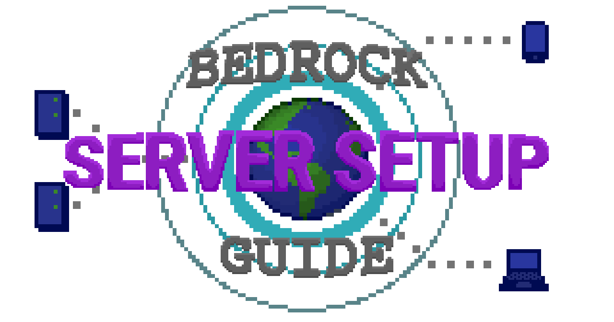

# Deutsch



Dieses Handbuch voraussetzt, dass du schon einen funktionalen und betriebsbereiten Server mit Minecraft Forge und Cubic Chunks hast.

Während du die Konfigurationsdatei editierst, sichergehe, dass du die Datei abspeichert vor Ablaufen zu nächstem Schritt!

Vor du fängst an: Es ist _absolut entscheidend_, dass du alle clientseitige und erforderliche Mods aus deinem Server entfernst \(abgesehen von Cubic Chunks\) damit ein Spieler mit keinem Ding, sondern Minecraft Forge und Cubic Chunks aufgestellte, den Server verbinden kann!

## Server Setup

1. Herunterlade die letzte Cubic Chunks Version aus [Jenkins](https://jenkins.daporkchop.net/job/Minecraft/job/CubicChunks/). Du wirst `CubicChunks-<version>-SNAPSHOT-all.jar` wollen.

   

2. Ersetze das jetzige Cubic Chunks Jar im Ordner `mods` deines Servers durch dem neu heruntergeladenen, dann starte den Server wieder.
3. Wechseln `allowVanillaClients` zu`true` in `config/cubicchunks.cfg`.

   ```bash
    # Ermöglicht Klienten ohne Cubic Chunks den Beitritt. DIES IST NUR FÜR VANILLA KLIENTEN GEDACHT . Es ist SEHR wahrscheinlich, dass dies bei der Verwendung mit anderen Mods kaputtgeht.
    B:allowVanillaClients=true
   ```

4. Du bist komplett, wenn dein Server nicht zu einem Netz gehört und du nicht Vanilla Klienten außer Java Edition 1.12.2 unterstützen wünschst. Starte deinen Server wieder und viel Spaß! Gehe andernfalls weiter.
5. Wechseln `online-mode` zu `false` in `server.properties`.

   ```text
   online-mode=false
   ```

6. Fahre zu [Mohist Setup](deutsch.md#mohist-setup) weiter, wenn dein Server läuft. Andernfalls, fahre zu [Forge Setup](deutsch.md#forge-setup) weiter.

### Mohist Setup

_Der folgende Abschnitt ist nur für Server-Besitzer die Mohist benutzt gedacht. Du kannst zu_ [_Forge Setup_](nederlands.md#forge-setup) _springen, wenn du nicht Mohist benutzt._

1. Herunterlade die letzte Mohist Version aus [Jenkins](https://ci.codemc.io/job/Mohist-Community/job/Mohist-1.12.2/lastSuccessfulBuild/artifact/projects/mohist/build/libs/).
2. Ersetze das jetzige Mohist Jar in deinem Serverordner durch dem neu heruntergeladenen, umbenenne den neuen ggf.
3. Wechseln  `bungeecord` zu `true` in `spigot.yml`.

   ```text
   bungeecord: true
   ```

4. Starte deinen Server wieder.
5. Fertig! Du kannst zu [Proxy Setup](nederlands.md#proxy-setup) weiterfahren.

### Forge Setup

Der folgende Absatz ist nur für Server-Besitzer gedacht, die **kein** Mohist benutzt. Du kannst zu [Mohist Setup](nederlands.md#mohist-setup) zurückkehren, wenn du nicht Mohist benutzt.\*

Notiz: Der folgende Mod ist gehalten, BungeeCord IP-Weiterleitung in Forge ohne SpongeForge \(da SpongeForge inkompatibel mit Cubic Chunks ist\) zu aktivieren

1. Herunterlade die letzte SpeedBoost Version aus [Jenkins](https://jenkins.daporkchop.net/job/PorkStudios/job/SpeedBoost/job/master/lastSuccessfulBuild/artifact/build/libs/).
2. Stelle den kürzlichen, heruntergeladen Mod in deinem Serverordner `mods` und starte den Server wieder.
3. Finde den `bungeecord` Abschnitt in `config/speedbost_config.json` und wechseln `state` zu `true`.

   ```javascript
   "bungeecord": {
    "state": true
   },
   ```

4. Starte deinen Server wieder.
5. Fertig! Du kannst zu [Proxy Setup](nederlands.md#proxy-setup) weiterfahren.

## Proxy Setup

_Du bist fertig, wenn der Wasserfall-Proxy deines Servers von jemand anderem gehostet wird \(zum Beispiel, du lässt deinen Bauserver als Teil des BuildTheEarth Big Network laufen\)._

Dieses Handbuch voraussetzt, dass du schon einen eingerichteten und betrieben BungeeCord Proxy hast. Falls du schon einen BungeeCord Proxy hast, kannst du einfach [die letzte Waterfall Version herunterladen](https://papermc.io/downloads#Waterfall) und ersetze das BungeeCord Jar. Wenn nicht, befolge die [offizielle Setup-Anleitung ](https://paper.readthedocs.io/en/latest/waterfall/getting-started.html) und konfiguriere es um zu deinem nachgeschaltetem Forge Server zu verbinden.

### Waterfall Setup

Notiz: bis [ViaVersion/ViaVersion\#2138](https://github.com/ViaVersion/ViaVersion/pull/2138) zusammengekommen sind, gibt es keine Download-Quelle für ViaVersion

1. Wechseln `forge_support` zu `true` in `config.yml`.

   ```text
   forge_support: true
   ```

2. Wechseln `ip_forward` zu `true` in `config.yml`.

   ```text
   ip_forward: true
   ```

3. Herunterlade das Folgende:  

   Geyser aus [Jenkins](https://ci.nukkitx.com/job/GeyserMC/job/Geyser/job/master/lastSuccessfulBuild/artifact/bootstrap/bungeecord/target/)  

   ViaVersion aus [hier](https://cdn.discordapp.com/attachments/295539008891518977/766749691949744138/ViaVersion-3.2.0-SNAPSHOT.jar)  

   _Empfohlen:_ Floodgate aus [Jenkins](https://ci.nukkitx.com/job/GeyserMC/job/Floodgate/job/development/lastSuccessfulBuild/artifact/bungee/target/)  

   _Optional:_ ViaBackwards aus [Jenkins](https://ci.viaversion.com/view/ViaBackwards/job/ViaBackwards/lastSuccessfulBuild/artifact/all/target/)  

   _Optional:_ ViaRewind aus [Jenkins](https://ci.viaversion.com/view/ViaRewind/job/ViaRewind/lastSuccessfulBuild/artifact/all/target/)

4. Stelle alle heruntergeladene Dateien im Ordner `plugins` von Waterfall, dann starte Waterfall wieder.
5. Wechseln `suppress-conversion-warnings` zu `true` in `plugins/ViaVersion/config.yml`.

   ```text
   # Wir warnen, wann es einen Fehler in der Gegenstand- Block Konvertierung gibt, sollten wir dies unterdrücken? (Nur vorgeschlagen für Spamming-Fall)
   suppress-conversion-warnings: true
   ```

6. Wechseln `general-thread-pool` zu der Zahl des Kerns in deinem Waterfall Server in `plugins/Geyser-BungeeCord/config.yml`. Zum Beispiel für 8 Kerne:

   ```text
   # Thread pool size 
   general-thread-pool: 8
   ```

7. Wechseln `cache-chunks` zu `true` in `plugins/Geyser-BungeeCord/config.yml`. Ignoriere die Warnungen, weil diese Merkmal entscheidend ist, um Bedrock Klienten mit Cubic Chunks richtig werken zu machen

   ```text
   # Configures if chunk caching should be enabled or not. This keeps an individual
   # record of each block the client loads in. While this feature does allow for a few
   # things such as block break animations to show up in creative mode and among others,
   # it is HIGHLY recommended you disable this on a production environment as it can eat
   # up a lot of RAM. However, when using the Spigot version of Geyser, support for features
   # or implementations this allows is automatically enabled without the additional caching as
   # Geyser has direct access to the server itself.
   cache-chunks: true
   ```

8. _Falls du hast Floodgate heruntergeladen:_ Finde den `player-link` Abschnitt in `plugins/floodgate-bungee/config.yml` und wechseln `enable` zu `true`.

   ```text
   # Authentifizierungsart. Es kann offline, online oder floodgate sein (sehe https://github.com/GeyserMC/Geyser/wiki/Floodgate).
   auth-type: floodgate
   ```

9. _Falls du Floodgate heruntergeladen hast_ Finde den `remote` Abschnitt in `plugins/Geyser-BungeeCord/config.yml` und wechseln `auth-type` zu `floodgate`.

   ```text
   # Ob das Verbindungssystem zu aktivieren. Wenn du dies deaktivierst, können Spieler die 
   # Verbindungsmerkmal nicht nutzen, auch wenn sie bereits verbunden sind 
   enable: true
   ```

10. Starte Waterfall wieder.

Glückwunsch! Du kannst jetzt eine Verbindung zu deinem Cubic Chunks Server durch Waterfall herzustellen, mit irgendeinen folgender Klienten:

* Cubic Chunks 1.12.2
* Vanilla Java Edition 1.12.2-1.16.3
* Bedrock Edition
* _Falls du ViaBackwards heruntergeladen hast:_ Vanilla Java Edition 1.9-1.16.3
* _Falls du ViaRewind heruntergeladen hast:_ Vanilla Java Edition 1.7-1.16.3

## Zusätzliche Notizen:

### ViaRewind und BungeeTabListPlus

Falls du ViaRewind gemeinsam mit BungeeTabListPlust auf Waterfall benutzt, erschaffe eine neue Datei `1-7-10.yml` in`plugins/BungeeTabListPlus/tabLists` mit dem folgenden Inhalt

```text
showTo: ${viewer client_version_below_1_8}
priority: 100000

showHeaderFooter: false
type: HEADER_FOOTER
```

Das ist erforderlich um Spielers Skin und Namensschild kaputtgehen zu verhindern, für Spieler die 1.7.10 und untern laufen.

